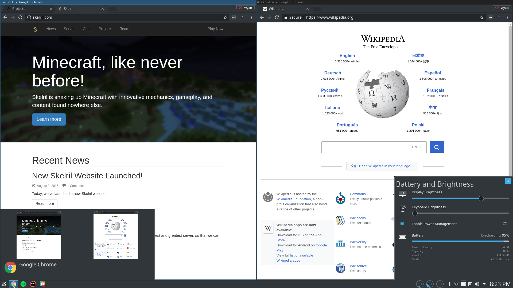

I recently started investigating using a tiling window manager simultaneously
with KDE. I chose i3 as my tiling manager of choice to experiment with.
I was surprised at how little information was available about how to create
a setup like this, so I've decided to write this post to share how I pulled
it off on KDE Neon (Ubuntu 16.04 base) w/ Plasma 5.8.

<!-- more -->

I was also surprised to find, that no one seems to say in plain English what
you'll get after you've finished. Thus, I'll start with that. If you do what
I did, you will get a functional KDE desktop, with a working panel,
working krunner, and working yakuake. There are three main differences
you'll notice. Firstly, your window borders will be that of i3's, not
of your KDE theme. Secondly, your desktop and applications will not be
composited, and thus will no longer have transparency. Thirdly, your
virtual desktops are now managed by i3, and the page will behave
in a slightly strange, but still functional way.



Alright, so, now that you know what to expect. The first thing you'll
need to do is clone https://github.com/sLite/i3. This is a fork of i3
that makes a few tweaks to i3 to make it function slightly
better with KDE; it's what I used, and it saves a lot of
manual configuration, and sleuthing. You'll have to build the
project; all the libraries you need are packaged by Ubuntu 16.04,
though it may take a bit of effort to track down the
specific ones missing from your system.

Once you have built the project using `make`, you'll need to set an install
directory. To do this, you'll want to use
`export PREFIX=$HOME/my_i3_install_dir/`. You can of course,
change `my_i3_install_dir` to anything you like.
After this, you'll need to run `make install`.

The next step, is to replace kwin, with your newly built
i3 window manager. Simply do the following (make sure to replace
my_i3_install_dir with your actual installation directory):

```
touch ~/.config/plasma-workspace/env/set_window_manager.sh
echo "export KDEWM=$HOME/my_i3_install_dir/bin/i3" >> ~/.config/plasma-workspace/env/set_window_manager.sh
chmod +x ~/.config/plasma-workspace/env/set_window_manager.sh
```

If all goes well, on your next login, you'll have i3 running instead of
kwin. Go ahead and do that now. i3 will ask you to generate an
initial configuration once you login. After it generates its initial
config, you'll need to make a few tweaks, you can find the file in
`$HOME/.config/i3/` it's simply named `config`. Find the lines:

```
bar {
        status_command i3status
        tray_output primary
}
```

Change these lines to be the following:

```
bar {
        mode invisible
        status_command i3status
        tray_output primary
}
```

This will hide the i3 bar, so you only have plasma's panel. Alternatively,
you could remove the KDE plasma panel, and leave this setting unchanged,
if you would prefer to work with the i3 bar.

While you're editing this file, if you're a yakuake user,
I'd recommend adding the following:

```
# Fix for yakuake
for_window [class="yakuake"] floating enable
```

This will ensure that yakuake is processed as a floating window,
and prevent i3 from attempting to tile it.

Once you've finished these steps, you're done! Just logout, and log back
in, or use the i3 restart keyboard shortcut to reload the configuration.
